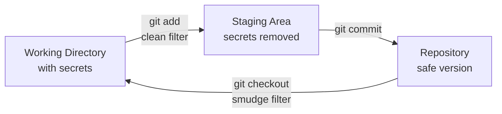

<div align="center">

# 🔒 Whiteout

**Keep Your Secrets Secret**

[](https://rust-lang.org)
[](https://opensource.org/licenses/MIT)
[](http://makeapullrequest.com)

A Git filter tool that keeps sensitive code local while committing safe alternatives to your repository.

[Features](#-features) • [Installation](#-installation) • [Quick Start](#-quick-start) • [Usage](#-usage) • [How It Works](#-how-it-works) • [Contributing](#-contributing)

</div>

---

## 🎯 Problem

Ever accidentally committed an API key? Hardcoded a password for testing? Left debug code in production?

**Whiteout** solves this by letting you maintain local-only code that never reaches your Git repository, while preserving safe alternatives in commits.

```javascript
// What you see locally:
const apiKey = "process.env.API_KEY"; // @whiteout: "sk-proj-SUPER-SECRET-KEY-123"

// What gets committed:
const apiKey = "process.env.API_KEY";
```

## ✨ Features

- 🔐 **Secure by Design** - Secrets never touch Git history
- 🎨 **Flexible Decorations** - Multiple ways to mark sensitive code
- ⚡ **Fast** - Written in Rust for optimal performance
- 🔄 **Seamless Integration** - Works transparently with Git workflows
- 🌍 **Language Agnostic** - Works with any text file or programming language
- 💬 **Multi-Comment Support** - Works with `//`, `#`, `--` comment styles
- 🛡️ **Safe Defaults** - Requires explicit marking to prevent accidents

## 📦 Installation

### Prerequisites

- Git (version 2.0 or higher)
- Rust toolchain (for building from source)

### Install from Source

```bash
# Clone the repository
git clone https://github.com/whiteout-dev/whiteout.git
cd whiteout

# Build and install
cargo build --release
sudo cp target/release/whiteout /usr/local/bin/

# Verify installation
whiteout --version
```


## 🚀 Quick Start

### 1. Initialize in Your Project

```bash
cd your-project
whiteout init
```

This automatically:
- Creates `.whiteout/` directory for local storage
- Configures Git filters in your repository
- Adds necessary `.gitattributes` entries

### 2. Mark Your Sensitive Code

Choose from multiple decoration styles that work with any comment format:

#### Inline Decoration
Works with any comment style (`//`, `#`, `--`):

```javascript
// JavaScript
const apiKey = "sk-12345"; // @whiteout: "process.env.API_KEY"
```

```python
# Python
api_key = "sk-12345"  # @whiteout: "os.environ['API_KEY']"
```

```sql
-- SQL
SELECT * FROM users WHERE key = 'sk-12345'; -- @whiteout: 'REDACTED'
```

#### Block Decoration
Hide entire code blocks between markers:

```javascript
// @whiteout-start
const DEBUG = true;
const SECRET_ENDPOINT = "http://localhost:3000";
console.log("Debug mode active");
// @whiteout-end
const DEBUG = false;  // This line stays in commits
```

#### Simple Decoration
For markdown or documentation, hide content after a marker:

```markdown
# Public Documentation

This content is committed.

\@whiteout
This content stays local only.
It won't appear in commits.

Back to public content.
```

#### Partial Replacement
For configuration values within strings:

```javascript
const url = "https://[[localhost:3000||api.example.com]]/v1";
// Locally: uses localhost:3000
// Committed: uses api.example.com
```

### 3. Work Normally

```bash
# Edit your files with secrets
vim config.js

# Commit as usual - secrets are automatically removed
git add .
git commit -m "Add configuration"

# Your local files keep the secrets
cat config.js  # Still shows your secret values
```

## 🎭 Decoration Patterns

### Inline Pattern
**Syntax:** `<code> // @whiteout: <replacement>`

**Note:** When documenting examples, escape the @ with backslash: `\@whiteout`

```python
# Local version:
password = "getpass.getpass()"  # @whiteout: "admin123"

# Committed version:
password = "getpass.getpass()"
```

### Block Pattern
**Syntax:** `@whiteout-start` ... `@whiteout-end`

```yaml
# @whiteout-start
debug_mode: true
verbose_logging: true
test_endpoints:
  - localhost:8080
# @whiteout-end
production_mode: true  # This stays in commits
```

### Simple Pattern
**Syntax:** `@whiteout` (hides everything until blank line)

```text
Normal content here.

\@whiteout
Secret information.
More secrets.

Public content resumes.
```

### Partial Pattern
**Syntax:** `[[local||committed]]`

```toml
[database]
host = "[[localhost||db.production.com]]"
port = [[5432||3306]]
```

## 📝 Documentation Escape Sequences

When writing documentation about Whiteout (like this README), use backslash to escape decorators:

```markdown
# To show the literal text in docs:
\@whiteout           # Shows as @whiteout
\@whiteout-start     # Shows as @whiteout-start
\@whiteout-end       # Shows as @whiteout-end

# These are treated as actual decorators:
@whiteout           # Would hide content (without backslash)
```

## 🔧 Commands

### Initialize Project
```bash
whiteout init [--path <dir>]
```

### Manual Operations
```bash
# Apply clean filter (remove secrets)
whiteout clean < file.txt

# Apply smudge filter (restore secrets)
whiteout smudge < file.txt
```

## 🔄 How It Works

Whiteout uses Git's clean/smudge filter mechanism:

1. **Clean Filter** (Working → Repository): Removes decorated local values before commit
2. **Smudge Filter** (Repository → Working): Restores local values after checkout



Local values are stored in `.whiteout/local.toml` (gitignored) and restored automatically.

## 🆚 Whiteout vs .env Files

Both Whiteout and .env files solve secret management, but with different approaches:

### Key Differences

| Aspect | Whiteout | .env Files |
|--------|----------|------------|
| **Where secrets live** | Inline with code | Separate file |
| **What you can hide** | Values, code blocks, files | Environment variables |
| **Git safety** | Automatic via filters | Manual via .gitignore |
| **Use case** | Development & debugging | Configuration management |

### Whiteout is Great For

- **Inline secrets** - See actual values where they're used
- **Debug code** - Hide entire blocks that shouldn't reach production
- **Mixed visibility** - Public and private code in the same file

### .env Files are Great For

- **Production config** - Standard for deployment platforms
- **Team workflows** - Everyone knows how they work
- **Docker/CI** - Built-in support everywhere

### They Work Well Together

Use each tool for what it does best:
```javascript
// Production config from .env
const dbHost = process.env.DB_HOST;

// Development secrets inline with Whiteout
const apiKey = "process.env.API_KEY"; // @whiteout: "sk-dev-12345"

// Debug code that stays local
// @whiteout-start
console.log("Debug mode: connecting to local services");
const DEBUG = true;
// @whiteout-end
```

## 🔒 Security Considerations

- **Never commit** `.whiteout/` directory (ensure it's in `.gitignore`)
- **Local values** are stored in `.whiteout/local.toml`
- **Backup** your local values separately
- **Use environment variables** for production secrets
- **Review commits** before pushing to ensure secrets are removed
- **Test filters** work correctly before committing sensitive data

## 🧪 Testing

```bash
# Run all tests
cargo test

# Run specific test
cargo test test_inline_parser

# Run with output
cargo test -- --nocapture

# Run integration tests
./tests/git_integration_test.sh
```

## 📋 Known Limitations / TODO

- **Smudge operation after marker removal**: When `@whiteout` markers are removed during the clean operation, the smudge filter cannot currently restore the hidden content when checking out files. This is a planned feature for a future release.

## 🤝 Contributing

Contributions are welcome!

### Development

```bash
# Build
cargo build

# Test
cargo test

# Format code
cargo fmt

# Lint
cargo clippy
```

## 📄 License

MIT License - see [LICENSE](LICENSE) for details.

## 📚 Resources

- [Git Attributes Documentation](https://git-scm.com/docs/gitattributes)
- [Git Filters Explained](https://git-scm.com/book/en/v2/Customizing-Git-Git-Attributes#_keyword_expansion)

